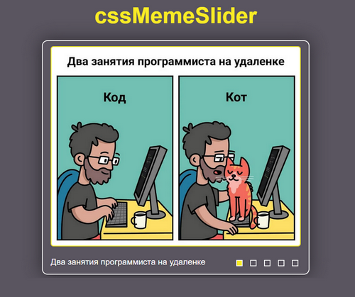

# [CSS Meme Slider](https://igor-bochenkov.github.io/slider-meme-css/)

Слайдер мемов, написанный на чистом HTML и CSS **(без использования JS)**.

- реализованы плавные анимации для смены картинок по клику на контролы.
- имеется мобильная версия слайдера.

https://igor-bochenkov.github.io/slider-meme-css/
